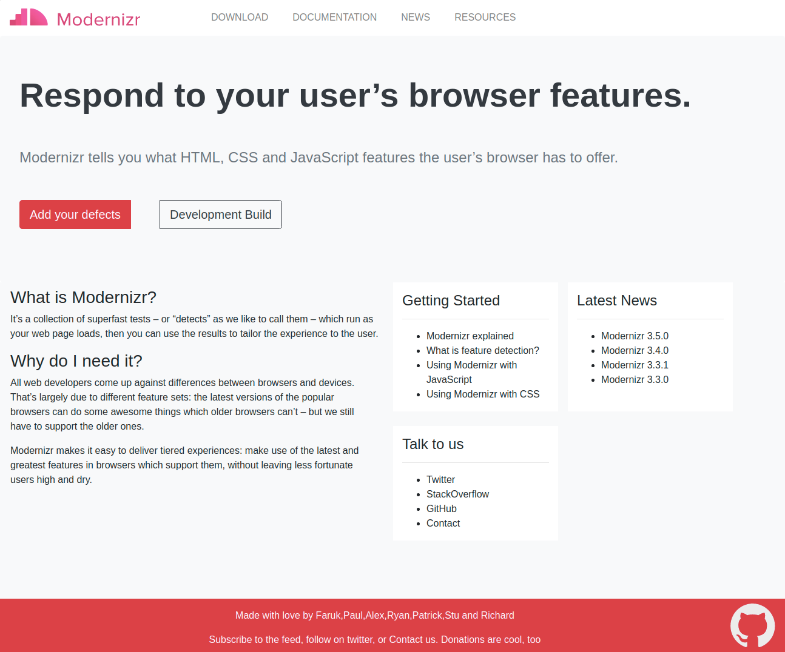
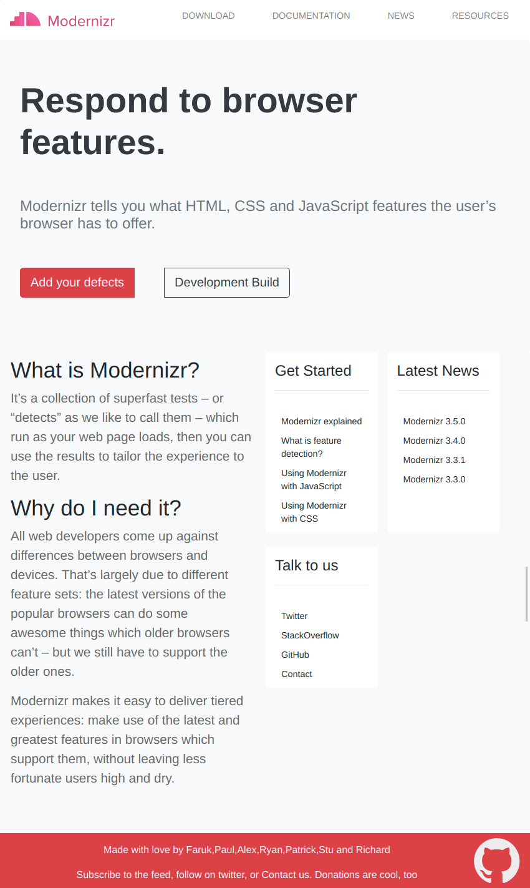

# Develop a Responsive Web Page for Modernizr 

## Context

Responsive Design patterns are used to make a web page responsive across various devices of varying screen sizes.Most design patterns will use breakpoints to adapt for different screen sizes. A Breakpoint is the point at which a different CSS will be applied, usually through a media query, to optimize the design for the user’s viewport. A good example of a breakpoint would be one where your layout has to change from two columns to four columns from one device to another.

For full-width multi-column layouts, column drop simply stacks the columns vertically as the window width becomes too narrow for the content.

Eventually this results in all of the columns being stacked vertically. Choosing breakpoints for this layout pattern is dependent on the content and changes for each design.

### Problem Statement

Transform the existing page design into a responsive page design, so that the company's web page is mobile responsive and tab responsive using the Bootstrap framewor using the Bootstrap framework.

The responsive web pages should resemble the following images.

#### Desktop Image

#### Tab Image

#### Mobile Image

### Details

All the images required can be found in the `./assets` folder

### Tasks

- The `index.html` file contains the code for web page that needs to be transformed into responsive web page.​
- The solution for this challenge can be developed in 2 steps:​
    - Step 1: Bootstrap CSS classes should be added inside the index.html file to style and make the web page responsive for desktop, tab and mobile devices.​
    - Step 2: The custom styles should be added to style.css located in the css folder of the boilerplate code.​

### Define Styles Using Bootstrap Class
| Purpose |Bootstrap Classes| Examples
|-------|--------|-----|
|Bootstrap responsive navigation header, the navbar for branding and navigation links|.navbar-brand, .navbar-nav, .collapse.navbar-collapse, .navbar-toggler| |
|Set an element's display property|.d-{value} for xs,​ .d-{breakpoint}-{value} for sm, md, lg, xl, and xxl | .d-sm-none, d-lg-inline |
| Shorthand, responsive margin and padding utility classes|m{side}-{size},p{side}-{size}|.mt-4, .mx-3, .mb-2​,.py-3, .pb-0, .pe-4|
|Manage the layout, alignment, and sizing of grid columns, navigation, components, and more with a full suite of responsive flexbox utilities|.d-flex, .d-inline-flex, .flex-xl-row, .flex-lg-row ||

**Note**: Use the Bootstrap template code from the official documentation link given below to create Navbar.

`https://getbootstrap.com/docs/5.2/components/navbar/`

**Explore more Bootstrap classes using the following link and use it to enhance the look and feel of the web page.​**

`https://getbootstrap.com/`
